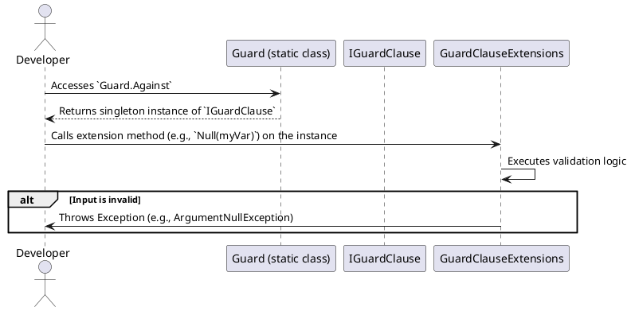

# High-Level Architecture v2: Modern Guard Clause C# Library

## 1. Overview

This document outlines the high-level architecture for the modernized `OpenEchoSystem.GuardClauses` C# library. The design is guided by the principles of **extensibility, performance, readability, and testability**, as defined in `docs/PRDMasterPlan.v2.md`. The architecture directly supports the AI-verifiable tasks in the master plan and is designed to pass all high-level acceptance tests outlined in `docs/master_acceptance_test_plan.v2.md`.

The core architectural pattern is a **fluent interface** accessed via a static entry point, with guard clause logic implemented as **extension methods** on a central interface. This approach promotes clean, readable code and makes the library highly extensible.

## 2. Core Components

The architecture is composed of a few key components that work together to provide the guard clause functionality.

### 2.1. `Guard` Static Class

This is the primary entry point for developers using the library.

-   **Namespace:** `OpenEchoSystem.GuardClauses`
-   **Definition:** `public static class Guard`
-   **Purpose:** Provides a single, static access point to the guard clause functionality.
-   **Key Member:**
    -   `public static IGuardClause Against { get; } = new GuardClause();`
    -   This property returns a singleton instance of the `GuardClause` class, which implements the `IGuardClause` interface. This ensures a lightweight and efficient entry point.

### 2.2. `IGuardClause` Interface

This interface is the anchor for all guard clause extension methods.

-   **Namespace:** `OpenEchoSystem.GuardClauses`
-   **Definition:** `public interface IGuardClause`
-   **Purpose:** Acts as a marker interface. Its sole purpose is to be the target for extension methods. This decouples the guard clause logic from the entry point and allows for easy extension. It has no members.

### 2.3. `GuardClause` Internal Class

This is the concrete implementation of the `IGuardClause` interface.

-   **Namespace:** `OpenEchoSystem.GuardClauses`
-   **Definition:** `internal class GuardClause : IGuardClause`
-   **Purpose:** A lightweight, internal, and sealed class that provides the singleton instance for the `Guard.Against` property. Keeping it internal prevents external instantiation or inheritance, enforcing the intended usage pattern.

### 2.4. Extension Method Classes

The actual guard clause logic is implemented in static classes as extension methods on the `IGuardClause` interface. This is the heart of the library's functionality and extensibility.

-   **Example:** `public static class GuardClauseStringExtensions`
-   **Purpose:** To group related guard clauses. For example, `GuardClauseStringExtensions` will contain guards like `NullOrEmpty` and `NullOrWhiteSpace`, while `GuardClauseNumericExtensions` will contain `Zero`, `Negative`, and `OutOfRange`.
-   **Implementation Detail:** Each extension method will accept the input value to be checked as the first parameter, followed by any other required parameters (e.g., range limits). Crucially, they will use the `[CallerArgumentExpression]` attribute to automatically capture the name of the input variable, eliminating "magic strings" in exception messages and improving the developer experience.

**Example Extension Method Signature:**

```csharp
public static void Null<T>(
    this IGuardClause guardClause,
    T inputValue,
    [CallerArgumentExpression("inputValue")] string? parameterName = null)
{
    if (inputValue is null)
    {
        throw new ArgumentNullException(parameterName);
    }
}
```

## 3. Data Flow and Interaction

The following sequence diagram illustrates the typical flow when a developer uses a guard clause.



## 4. Alignment with PRDMasterPlan.v2.md and Acceptance Tests

This architecture directly supports the project's goals:

-   **Phase 2: Architecture and Design:** The definition of `Guard`, `IGuardClause`, and the extension method structure directly fulfills the tasks of this phase.
-   **Phase 3: Core Guard Clause Implementation:** The extension method pattern provides the framework for implementing all the required guard clauses (`Null`, `OutOfRange`, `InvalidEmail`, etc.).
-   **Performance (`Test_Performance_Benchmarks`):** The architecture allows for performance-critical implementations within the extension methods, such as using pre-compiled regex for `InvalidEmail` and `InvalidUrl` guards, as specified in the research.
-   **Extensibility (`Test_Custom_Guard_Clause_Extension`):** Developers can easily add their own guard clauses by creating a new static class with extension methods targeting `IGuardClause`. This is a core strength of this design and is documented in `docs/extensibility_guide.md`.
-   **Modern C# Features:** The mandated use of `[CallerArgumentExpression]` is a key architectural decision that fulfills a primary project goal.

## 5. Technology Choices

-   **.NET 9.0:** The library will target .NET 9.0 to leverage the latest language features and performance improvements.
-   **C# 13:** Will be used to implement the library, taking advantage of features like `[CallerArgumentExpression]`.
-   **xUnit:** The testing framework for all unit and integration tests.
-   **BenchmarkDotNet:** For performance benchmarking against other libraries.
-   **DocFX:** For generating API documentation from XML comments.

## 6. Security Considerations

The library has a minimal attack surface. Input validation is the core purpose of the library, not a source of vulnerability. Care will be taken to ensure that regular expressions used for validation are not susceptible to ReDoS (Regular Expression Denial of Service) attacks by using timeouts and efficient, non-backtracking patterns where possible.

## 7. Conclusion

This high-level architecture provides a solid foundation for building a modern, performant, and extensible Guard Clause library. It aligns with the project's master plan, supports all acceptance criteria, and incorporates best practices and key findings from the research phase.